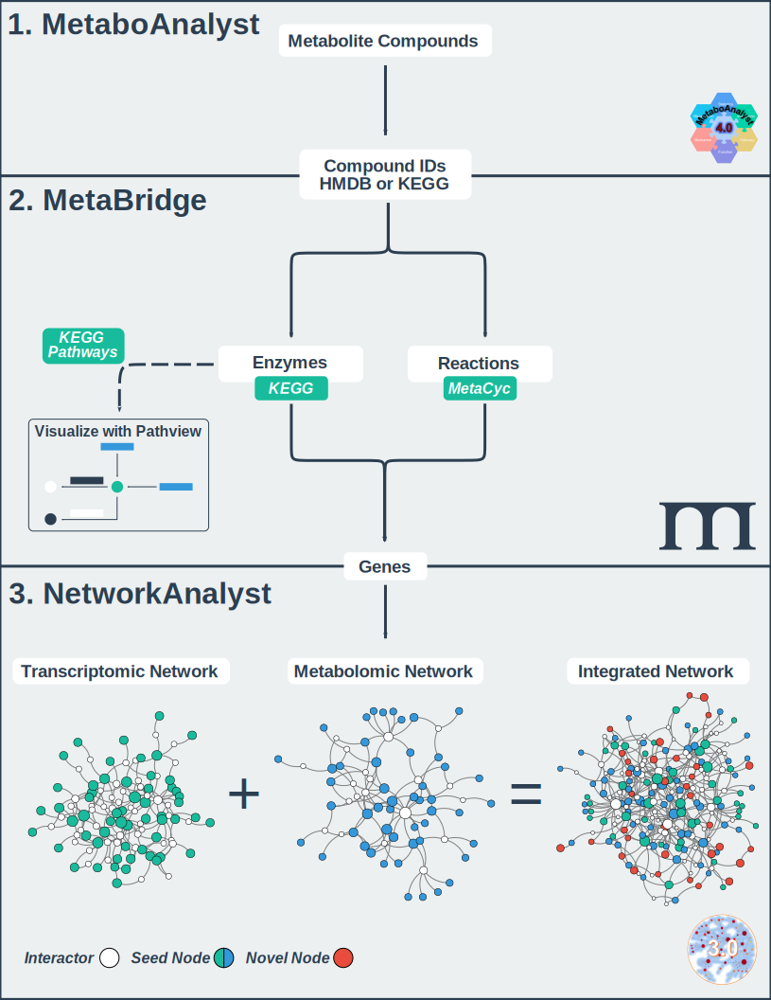

# **MetaBridge**

 

MetaBridge is a [Shiny](https://shiny.rstudio.com/)-based application for
integration of metabolomics data with other omics data types, chiefly
transcriptomics and proteomics. It leverages publicly available data from both
[MetaCyc](https://metacyc.org/) and [KEGG](https://www.genome.jp/kegg/) to map
input metabolites to genes, through pathways and reactions in which the
metabolite is involved.

## **Publications**

* [MetaBridge: enabling network-based integrative analysis via direct protein interactors of metabolites](https://doi.org/10.1093/bioinformatics/bty331). 2018. *Bioinformatics.*

* [MetaBridge: An Integrative Multi‐Omics Tool for Metabolite‐Enzyme Mapping](https://doi.org/10.1002/cpbi.98). 2020. *Current Protocols in Bioinformatics.*

## **Usage**
MetaBridge is designed to facilitate integrative analysis by identifying the
enzymes that directly interact with metabolites of interest, yielding genes
which may then be integrated with results from other omics methods. A pipeline
may be designed as such:

## **Tutorial**
To learn how to use MetaBridge as part of a network-based integrative analysis
workflow, please read our [tutorial](./tutorial/tutorial.md). For a more
detailed guide on using MetaBridge you can read our
[publication](https://doi.org/10.1002/cpbi.98) in *Current Protocols in
Bioinformatics*.

## **Authors**
MetaBridge was developed by Sam Hinshaw, as part of his work at the REW Hancock
Lab at the University of British Columbia. Further updates and ongoing 
maintenance are done by Travis Blimkie, a current member of the REW Hancock Lab.

