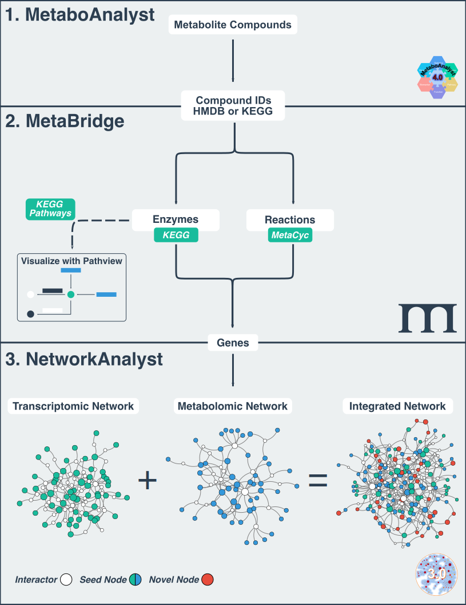

# **MetaBridge**

 

MetaBridge is a [Shiny](https://shiny.rstudio.com/)-based web application 
designed to facilitate the integration of metabolomics data with other omics 
data types, chiefly transcriptomics and proteomics. It leverages publicly 
available data from [MetaCyc](https://metacyc.org/) and 
[KEGG](https://www.genome.jp/kegg/) to map input metabolites to genes through
pathways and reactions in which the metabolite is involved.

## Usage
MetaBridge supports integrative multi-omic analyses by identifying the enzymes
that directly interact with your metabolites of interest, providing genes which
may then be easily integrated with results from other omics methods. An example
integrative analysis pipeline using 
[MetaboAnalyst](https://www.metaboanalyst.ca/MetaboAnalyst/ModuleView.xhtml),
[MetaBridge](https://metabridge.org), and 
[NetworkAnalyst](https://www.networkanalyst.ca/) is outlined below:

## Tutorial
To learn how to use MetaBridge as part of a network-based integrative analysis
workflow, please read our [tutorial](./tutorial/tutorial.md). For a more
detailed guide on using MetaBridge you can read our
[publication](https://doi.org/10.1002/cpbi.98) in *Current Protocols in
Bioinformatics*.

## Help & Bug Reporting
If you encounter problems when using MetaBridge, please create an 
[issue](https://github.com/hancockinformatics/MetaBridgeShiny/issues) on our
Github page, including detailed information on your input and any errors or 
messages you received (screenshots encouraged).

## Publications
When using MetaBridge for your own analysis, please cite one of the following:

* [MetaBridge: enabling network-based integrative analysis via direct protein
  interactors of metabolites](https://doi.org/10.1093/bioinformatics/bty331):
  *Bioinformatics*, 2018.
* [MetaBridge: An Integrative Multi‐Omics Tool for Metabolite‐Enzyme
  Mapping](https://doi.org/10.1002/cpbi.98): *Current Protocols in
  Bioinformatics*, 2020.

## Authors
MetaBridge was developed by Samuel Hinshaw, as part of his work at the [REW
Hancock Laboratory](http://cmdr.ubc.ca/bobh/) at the University of British
Columbia. Further updates and ongoing maintenance are done by Travis Blimkie, a
current member of the Hancock Lab.

## License
Source code for MetaBridge is available under  [GNU General Public License
v3](https://github.com/hancockinformatics/MetaBridgeShiny/blob/master/LICENSE).

## Versioning
This app utilizes SemVer as outlined
[here](https://semver.org/spec/v2.0.0.html).
