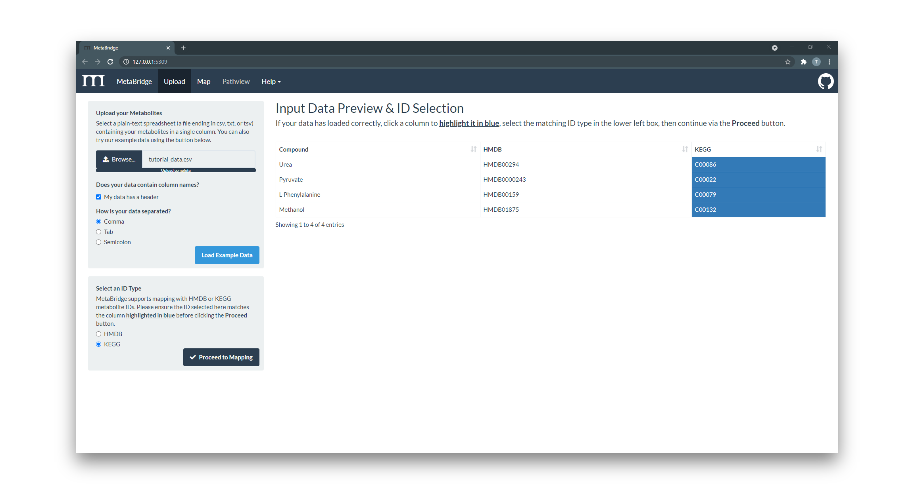
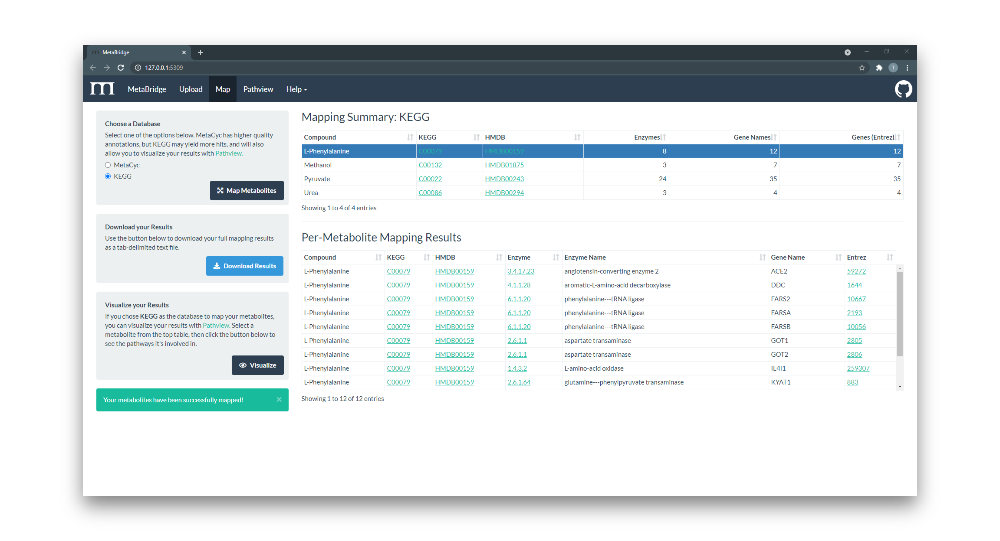
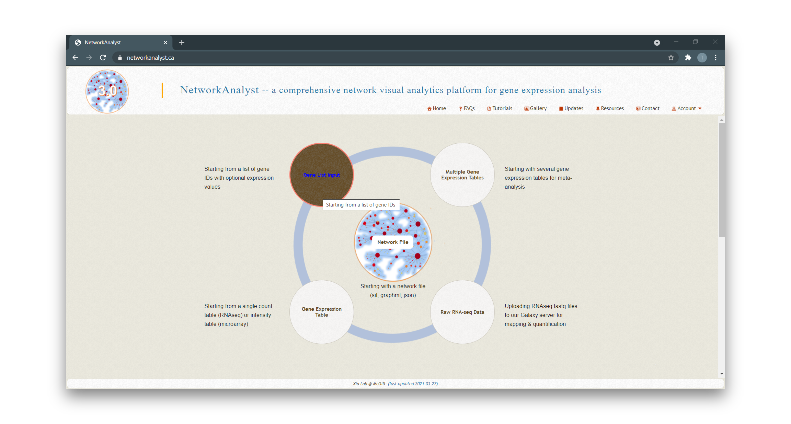
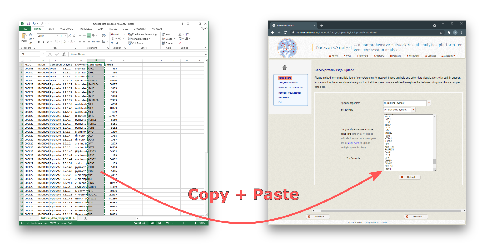
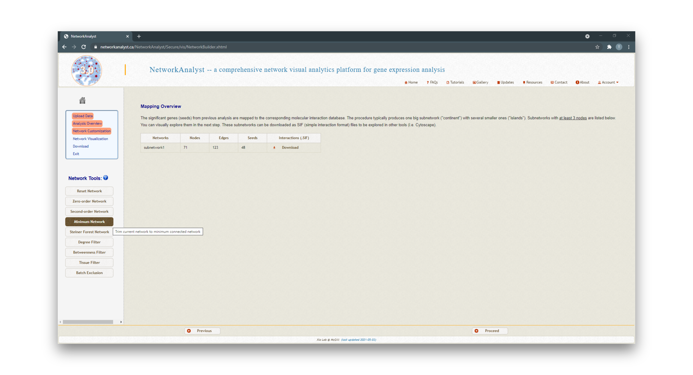
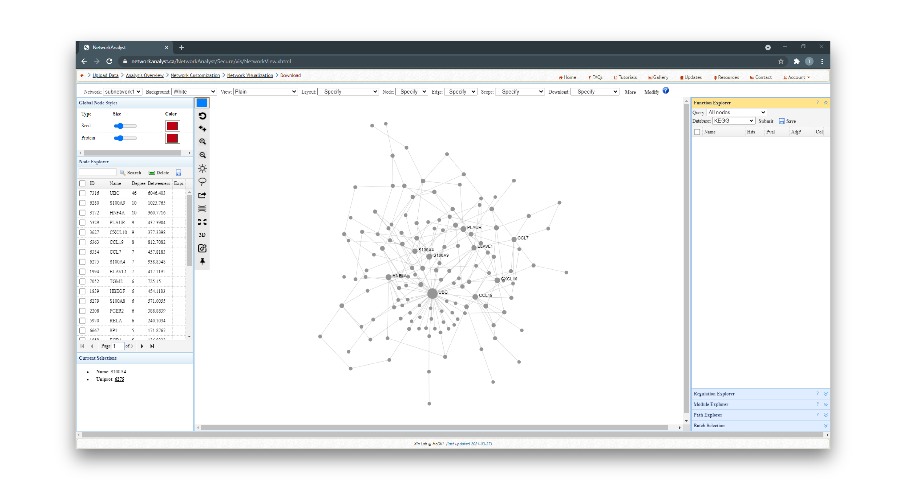
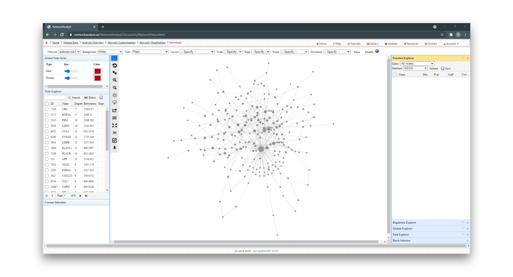
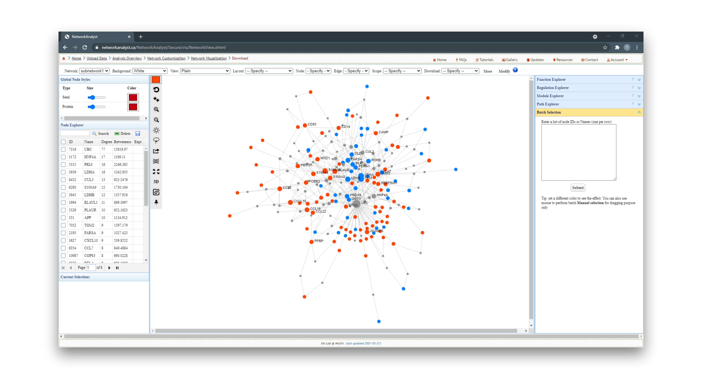

<h2 id='metabolite-preprocessing'>1. Metabolite Preprocessing (Optional)</h2>

To start using MetaBridge, you need to upload your list of compounds as
metabolite IDs (HMDB or KEGG). If you are starting with raw metabolomics data
(i.e. compounds names, such as glucose), you will need to preprocess your
metabolites with your method of choice  to obtain their corresponding HMDB or
KEGG IDs. We recommend [MetaboAnalyst](http://www.metaboanalyst.ca) for
metabolite preprocessing and ID mapping.

 

<h2 id='metabridge-mapping'>2. MetaBridge Mapping</h2>

### I. Upload Metabolites

Navigate to [MetaBridge](https://www.metabridge.org) and upload the file
containing your metabolite IDs. Then, select the column to be used in the
mapping and the matching ID type (HMDB or KEGG). We've elected here to use KEGG
IDs.

### II. Map Metabolites

Choose a database to map against and view your mapping results. Here, we've
mapped our metabolites via KEGG, to maximize the number of mapped genes
MetaBridge returns.

### III. Download Results

Use the button to download your full mapping results from MetaBridge - the table
below shows the first few rows from our mapped data.

<table class="table table-dark table-hover table-bordered">
  <thead class="thead-dark">
    <tr>
      <th>Compound</th>
      <th>KEGG</th>
      <th>HMDB</th>
      <th>Enzyme</th>
      <th>Enzyme Name</th>
      <th>Gene Name</th>
      <th>Entrez</th>
    </tr>
  </thead>
  <tbody>
    <tr>
      <td>Urea</td>
      <td>C00086</td>
      <td>HMDB00294</td>
      <td>3.5.3.1</td>
      <td>arginase</td>
      <td>ARG1</td>
      <td>383</td>
    </tr>
    <tr>
      <td>Urea</td>
      <td>C00086</td>
      <td>HMDB00294</td>
      <td>3.5.3.1</td>
      <td>arginase</td>
      <td>ARG2</td>
      <td>384</td>
    </tr>
    <tr>
      <td>Urea</td>
      <td>C00086</td>
      <td>HMDB00294</td>
      <td>3.5.3.4</td>
      <td>allantoicase</td>
      <td>ALLC</td>
      <td>55821</td>
    </tr>
    <tr>
      <td>Urea</td>
      <td>C00086</td>
      <td>HMDB00294</td>
      <td>3.5.3.11</td>
      <td>agmatinase</td>
      <td>AGMAT</td>
      <td>79814</td>
    </tr>
    <tr>
      <td>Pyruvate</td>
      <td>C00022</td>
      <td>HMDB00243</td>
      <td>1.1.1.27</td>
      <td>L-lactate dehydrogenase</td>
      <td>LDHAL6A</td>
      <td>160287</td>
    </tr>
  </tbody>
</table>

 

<h2 id='networkanalyst'>3. NetworkAnalyst</h2>

### I. Upload Mapped Genes

Visit [NetworkAnalyst](http://www.networkanalyst.ca) and select [Gene List
Input] from the possible options.

Follow these steps to upload your mapped genes to NetworkAnalyst:
* Paste in the genes that you received from MetaBridge
* Repeat this for each gene or protein list you wish to integrate, separating
  each list with a `//` as instructed.
* For this tutorial, we've uploaded two gene lists

Once you have uploaded all of your gene/protein lists, select "Homo sapiens" 
as the organism, and "Official gene symbol" as the ID type.

Next, click [Proceed], then choose [Generic PPI] which will open a dialog box.
At the top, select "Union of all lists" to create the combined network, then
choose the literature-curated IMEX Interactome as your protein-protein
interaction (PPI) database. Click [OK], then [Proceed] to continue.

### II. Create Networks

Now, a PPI network will be generated based on the data you have uploaded.
Depending on the size of the dataset you have uploaded, you may wish to choose
from the network types on the right side. Generally, we recommend using a
minimum-connected PPI network.

However, if your data are particularly sparse, you may need to use first-order
interaction networks, whereas if your dataset is particularly large, you may
wish to use a zero-order interaction network. Typically, we aim for a network
containing a few hundred nodes.

Below, you will find an example of each minimum-connected network generated
from the two individual gene lists, and the combined list.

1. Minimum-connected PPI network from MetaBridge-mapped metabolites.

2. Minimum-connected PPI network from gene expression data.

3. Minimum-connected PPI network from combined gene list.

### III. Analyze the Network

For each network you create, you can extract various information from the
network. For example, you can use the [Function Explorer] panel on the right
side to view pathway enrichment analyses of the networks. On the lefthand side,
you can use the [Node Explorer] to view information about individual nodes of
the network and [Save] the entire node list as a CSV file for further analysis.

You can also tweak the network appearance as you would like. For example, you
can paste in your original lists to the [Batch Selection] panel on the right and
colour-code each node of the network corresponding to its original data source.
Then, you can download image files of the networks you have created.

 
